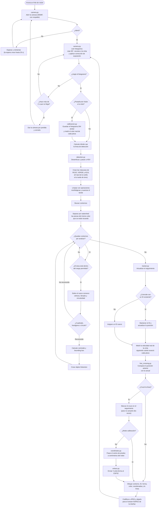

# Flujograma del sistema de visión artificial

El bucle vive en `pc/kuko/vision.py` y corre en su propio hilo, dentro de la
aplicación de PC. Usa los módulos de este directorio (`camera.py`,
`detection.py`, `tracker.py`, `line_crossing.py`, `coordinates.py`), que son
los que están calibrados.

Dos cosas que el diagrama muestra y conviene no perder de vista:

- **Son dos bucles, uno adentro del otro.** El de afuera abre la cámara y la
  vuelve a abrir cuando se pierde; el de adentro procesa fotogramas mientras
  haya. Una cámara USB desenchufada **no da error**: `read()` devuelve `False`
  para siempre y `isOpened()` sigue diciendo que sí, así que lo único que la
  delata es cuánto hace que no llega un fotograma. Y reabrirla hace falta de
  verdad: el `VideoCapture` queda muerto y volver a enchufar el cable no
  arregla nada sin un objeto nuevo.
- **En modo calibración no se informa ninguna pieza.** Con la cinta parada y
  alguien apoyando piezas a mano, cada pieza apoyada cruza la línea —la cruza
  la mano— y el brazo salía a buscarla. El cruce igual se marca en el
  seguimiento, para que al salir de calibración no se avise de golpe todo lo
  que quedó del otro lado.

