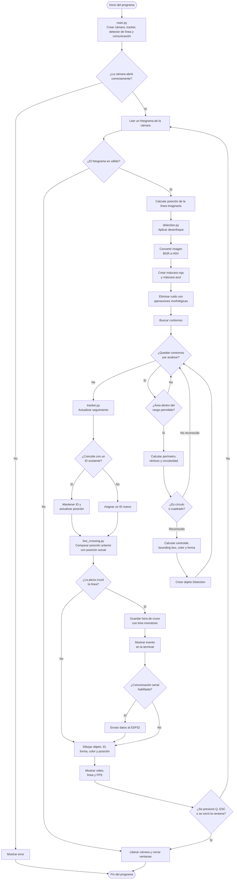

# Flujograma del sistema de visión artificial

```mermaid
flowchart TD

    A([Inicio del programa]) --> B["main.py<br/>Crear cámara, tracker, detector de línea y comunicación"]

    B --> C{"¿La cámara abrió correctamente?"}

    C -- "No" --> Z["Mostrar error"]
    Z --> FIN([Fin del programa])

    C -- "Sí" --> D["Leer un fotograma de la cámara"]

    D --> E{"¿El fotograma es válido?"}

    E -- "No" --> LIBERAR["Liberar cámara y cerrar ventanas"]
    LIBERAR --> FIN

    E -- "Sí" --> F["Calcular posición de la línea imaginaria"]

    F --> G["detection.py<br/>Aplicar desenfoque"]

    G --> H["Convertir imagen<br/>BGR a HSV"]

    H --> I["Crear máscara roja<br/>y máscara azul"]

    I --> J["Eliminar ruido con<br/>operaciones morfológicas"]

    J --> K["Buscar contornos"]

    K --> L{"¿Quedan contornos<br/>por analizar?"}

    L -- "No" --> TRACKER["tracker.py<br/>Actualizar seguimiento"]

    L -- "Sí" --> M{"¿Área dentro del<br/>rango permitido?"}

    M -- "No" --> L

    M -- "Sí" --> N["Calcular perímetro,<br/>vértices y circularidad"]

    N --> O{"¿Es círculo<br/>o cuadrado?"}

    O -- "No reconocido" --> L

    O -- "Reconocido" --> P["Calcular centroide,<br/>bounding box, color y forma"]

    P --> Q["Crear objeto Detection"]

    Q --> L

    TRACKER --> R{"¿Coincide con un<br/>ID existente?"}

    R -- "Sí" --> S["Mantener ID y<br/>actualizar posición"]

    R -- "No" --> T["Asignar un ID nuevo"]

    S --> U["line_crossing.py<br/>Comparar posición anterior<br/>con posición actual"]

    T --> U

    U --> V{"¿La pieza cruzó<br/>la línea?"}

    V -- "No" --> DIBUJAR["Dibujar objeto, ID,<br/>forma, color y posición"]

    V -- "Sí" --> W["Guardar hora de cruce<br/>con time.monotonic"]

    W --> X["Mostrar evento<br/>en la terminal"]

    X --> Y{"¿Comunicación serial<br/>habilitada?"}

    Y -- "Sí" --> SERIAL["Enviar datos al ESP32"]
    Y -- "No" --> DIBUJAR

    SERIAL --> DIBUJAR

    DIBUJAR --> MOSTRAR["Mostrar video,<br/>línea y FPS"]

    MOSTRAR --> SALIR{"¿Se presionó Q, ESC<br/>o se cerró la ventana?"}

    SALIR -- "No" --> D
    SALIR -- "Sí" --> LIBERAR
```