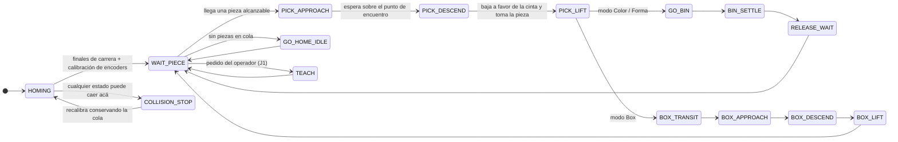
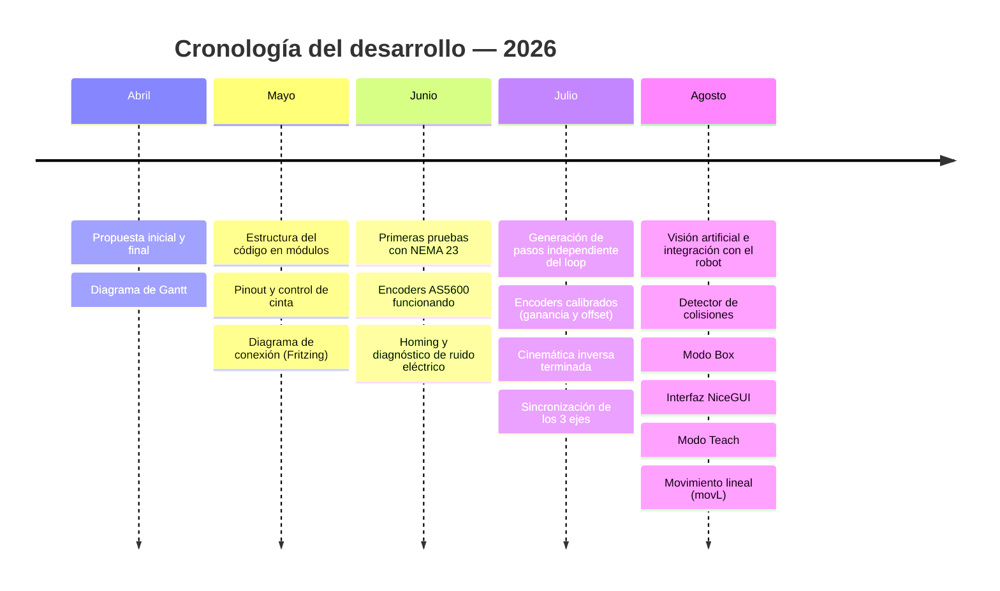

<div align="center">


<br>

# KUKO DELTA CARBON

### Robot delta de 3 GDL con visión artificial para clasificación de piezas sobre cinta en movimiento

<br>

[](#)
[](#)
[](#)

[](https://ingenieria.unlz.edu.ar/)
[](https://platformio.org/)
[](#)
[](#)
[](#)
[](#)
[](#)

<br>


**Universidad Nacional de Lomas de Zamora · Facultad de Ingeniería**<br>
**Ingeniería Mecatrónica**

</div>

---

## Ficha del proyecto

|                   |                                                               |
| :---------------- | :------------------------------------------------------------ |
| **Proyecto**      | KUKO Delta Carbon                                              |
| **Tipo**          | Proyecto Final (PF)                                            |
| **Año / Período** | 2026 — 1.er Cuatrimestre                                       |
| **Carrera**       | Ingeniería Mecatrónica                                         |
| **Autores**       | **DE PALMA, Marcos Agustín** · **REYNAGA RÍOS, Leandro Joel**  |
| **Institución**   | Facultad de Ingeniería — UNLZ                                  |
| **Estado**        | 🟢 Prototipo funcional     |
| **Repositorio**   | `2026_1C_PF_KUKO-DELTA_DE-PALMA_REYNAGA`                       |

---

<div align="center">

> 🖼️ **`IMAGEN PENDIENTE`** · `Multimedia/01-robot-completo.jpg`<br>
> **Qué mostrar:** el robot delta completo de frente, con la cinta transportadora en primer plano,
> los tres tachos de destino y el gabinete de electrónica a la vista.<br>
> <sub>Al subirla, reemplazar este bloque por ``</sub>

</div>

---

<a id="indice"></a>

## 📑 Índice

|  #  | Sección                                              | Contenido                                 |
| :-: | :--------------------------------------------------- | :---------------------------------------- |
|  1  | [Introducción y objetivos](#introduccion)             | Contexto, problema y objetivos            |
|  2  | [Brief](#brief)                                       | Pitch, solución, alcance y estado         |
|  3  | [Descripción técnica](#descripcion-tecnica)           | Cómo funciona por dentro                  |
|  4  | [Arquitectura del sistema](#arquitectura)             | Diagramas, protocolo y flujo de datos     |
|  5  | [Instrucciones de uso](#uso)                          | Puesta en marcha reproducible             |
|  6  | [Tecnologías utilizadas](#tecnologias)                | Stack de firmware, visión e interfaz      |
|  7  | [Listado de componentes](#componentes)                | BOM con cantidades y modelos              |
|  8  | [Esquemáticos y planos](#planos)                      | Diagrama de conexión y pinout             |
|  9  | [Fotos y videos](#multimedia)                         | Material de la demostración               |
| 10  | [Desarrollo del proyecto](#desarrollo)                | Hitos y metodología de trabajo            |
| 11  | [Verificación y pruebas](#pruebas)                    | Estrategia de testeo                      |
| 12  | [Estado actual y trabajo futuro](#roadmap)            | Qué anda hoy y qué falta                  |
| 13  | [Estructura del repositorio](#estructura)             | Mapa de carpetas                          |
| 14  | [Autores](#autores)                                   | Contacto                                  |

---

<a id="introduccion"></a>

## 1 · Introducción y objetivos

### Contexto


**KUKO Delta Carbon** es una celda de clasificación, de escala didáctica pero con criterios
industriales, construida íntegramente por los autores: mecánica, electrónica, firmware, visión
artificial e interfaz de operación.

### Problema a resolver

Tomar piezas **en movimiento** sobre una cinta transportadora y depositarlas en el destino que les
corresponde, sin detener la cinta, es un problema de sincronización. Resolverlo exige medir la latencia del sistema
de visión, predecir la posición futura de la pieza y planificar la intercepción, todo con hardware
de bajo costo y sobre motores paso a paso.


### Objetivo general

> Diseñar, construir y poner en marcha una celda robótica de clasificación automática basada en un
> robot delta de 3 grados de libertad, capaz de detectar piezas por **color** y **forma** mediante
> visión artificial, interceptarlas sobre una cinta en movimiento y depositarlas en su destino,
> supervisada desde una interfaz de operación propia.


---

<a id="brief"></a>

## 2 · Brief


> **KUKO Delta Carbon** es una celda robótica *pick & place* que clasifica piezas por color y forma
> sobre una cinta en movimiento, pensada para tareas de selección repetitivas.


Este proyecto **KUKO Delta Carbon** (Proyecto Final, **2026 · 1.er Cuatrimestre**) resuelve la
**clasificación manual de piezas en línea de producción** mediante un **robot delta de 3 GDL con
visión artificial que intercepta las piezas sin detener la cinta**.
Permite **clasificar
por color, por forma o armar una caja de 6 posiciones**, con una interfaz que muestra en vivo el
estado de cada componente, la producción acumulada y la disponibilidad de la celda.

Se implementa con **ESP32 + C++ (PlatformIO)** para el control en tiempo real y **Python + OpenCV +
NiceGUI** para la visión y la operación, y se valida con **98 pruebas automáticas** que verifican
tanto el protocolo de comunicación como la matemática del movimiento.


<table>
<tr><td width="52%" valign="top">

**Para lograrlo:**

- 👁️ **Detecta** piezas por color (rojo · verde · azul) y forma (cuadrado · hexágono · círculo)
- 🎯 **Intercepta** la pieza en movimiento
- 🗑️ **Clasifica** en 3 tachos, por color o por forma
- 📦 **Modo Box:** llena una caja de 6 celdas con una disposición de colores configurable
- 🛡️ **Supervisa colisiones** con encoders magnéticos y se recupera sola rehomeando
- 🧑‍🏫 **Modo Teach:** el operador mueve el brazo a mano, graba secuencias y las reproduce
- 📊 **Mide su propia producción:** piezas, ritmo, fallos y disponibilidad
- ⚙️ **62 parámetros ajustables**, sin recompilar y persistidos en la placa

</td><td width="48%" valign="top">


```
      Cámara USB 720p
             ↓  OpenCV (HSV + contornos)
  Color · Forma · Posición Y
             ↓  Serie 115200 8N1
  ESP32 — planificación e intercepción
             ↓  Cinemática inversa delta
  3 × NEMA 23 (10.000 µpasos/vuelta)
             ↓  Ventosa de vacío
  Pieza depositada en su destino
             ↑
  3 × AS5600 → supervisión de colisión
```


</td></tr>
</table>

### Alcance

<table>
<tr>
<th width="50%">✅ Incluye</th>
<th width="50%">🚫 No incluye</th>
</tr>
<tr><td valign="top">

- Robot delta de 3 GDL con ventosa de vacío
- Cinta transportadora con velocidad regulada por PWM
- Visión artificial por color y forma, con seguimiento
- Intercepción de piezas en movimiento
- Detección de colisiones y recuperación automática
- Registro de fallos e indicadores de producción
- Interfaz web de operación, proceso y servicio
- Modo Teach con grabación y reproducción de rutas
- Movimiento lineal (movL) en el espacio cartesiano

</td><td valign="top">


- Paro de emergencia certificado (hoy: corte de alimentación de drivers)
-  Vacuostato (confirmación **física** del vacío)
- Comunicación con PLC / SCADA de planta
- Clasificación por tamaño o por código impreso
- Alimentador automático de piezas
- Redes neuronales: la visión es clásica y determinística

</td></tr>
</table>

### Estado del proyecto

| Aspecto              | Estado                                                                                    |
| :------------------- | :---------------------------------------------------------------------------------------- |
| **Madurez**          | ✅ Prototipo funcional                                 |
| **Ciclo completo**   | ✅ Homing → detección → intercepción → agarre → clasificación → retorno                    |
| **Modos operativos** | ✅ Color · Forma · Box · Teach                                                    |
| **Seguridad**        | ✅ Supervisión de colisión activa, con recuperación automática                             |
| **Interfaz**         | ✅ 5 pestañas operativas (Operación, Teach, Rendimiento, Proceso, Servicio)                 |


> 🎬 **`VIDEO PENDIENTE`** · `Multimedia/09-video-demo.mp4`<br>
> **Qué mostrar:** un ciclo completo de clasificación por color, en tiempo real, con la interfaz visible.<br>
> <sub>Si el archivo es pesado, subirlo a YouTube/Drive y dejar acá el enlace.</sub>

> 🖼️ **`GIF PENDIENTE`** · `Multimedia/02-celda-en-marcha.gif`<br>
> **Qué mostrar:** 5–8 segundos en bucle del brazo tomando una pieza de la cinta en movimiento.
> Es la imagen que resume el proyecto entero.


---

<a id="descripcion-tecnica"></a>

## 3 · Descripción técnica

El sistema se reparte entre **dos computadoras** con responsabilidades bien separadas: el ESP32 hace
lo que **no puede esperar** (generar pasos, leer encoders, decidir cuándo bajar el brazo) y la PC hace
lo que **necesita memoria y potencia** (procesar imagen, dibujar, recordar sucesos).

### 3.1 · Ciclo de clasificación





### 3.2 · Modos de clasificación

| Modo | Comando | Qué hace |
| :--- | :-----: | :------- |
| **Color** | `C` | Tacho 1 rojo · Tacho 2 verde · Tacho 3 azul |
| **Forma** | `F` | Tacho 1 cuadrado · Tacho 2 hexágono · Tacho 3 círculo |
| **Box** | `A` | Llena una caja de 6 celdas (2 filas × 3 columnas) con una disposición de colores configurable; máximo 3 piezas por color. El resto de las piezas siguen de largo |


### 3.3 · Visión artificial

La detección corre en la PC sobre **OpenCV**, con procesamiento clásico (sin redes neuronales): es
determinístico, se calibra a mano.


**La `X` de la pieza no viaja por el enlace.** Como el aviso se emite exactamente en el cruce de la
 línea de detección, la `X` es siempre la misma y es conocida por las dos partes. Solo viajan
 `Y`, color y forma — tres campos, dos comas, una línea.


### 3.4 · Cinemática

`DeltaKinematics` es un espacio de nombres puramente matemático —sin entrada/salida ni llamadas a
motores— que resuelve la **cinemática inversa** del delta. La **cinemática directa** vive del lado de
Python (`cinematica.py`), y la necesita para dibujar el brazo en pantalla.


 


### 3.5 · Generación de pasos y perfiles de movimiento

Cada eje se maneja con un **timer de hardware dedicado** del ESP32 y una rampa trapezoidal calculada
con el **algoritmo de Austin (2004)**.


**Coordinación multi-eje.** `Motors::moveSynchronized` escala velocidad y aceleración de cada eje en
proporción a su recorrido, de modo que los tres motores **arrancan y llegan juntos** aunque recorran
distancias distintas.


### 3.6 · Supervisión de colisiones

**No es control de posición** — la posición sigue siendo lazo abierto por micropasos. Es un
 **detector de discrepancia**: en cada vuelta del loop compara el ángulo medido contra el que dicen
 los pasos emitidos, y si la diferencia supera el umbral **y se sostiene** durante un tiempo de
 confirmación, declara colisión.

**El umbral no es fijo:**

```
umbral_efectivo = UMBRAL_DEG + MARGEN_VELOCIDAD_MS × velocidad
```


**Reacción ante colisión:** frena los 3 ejes → suelta la pieza → espera 3 s → rehomea conservando la
cola de piezas. Tras 3 colisiones seguidas, pasa a `ERROR`.

### 3.7 · Modo Teach

Un modo aparte del ciclo de clasificación: el operador maneja el brazo a mano desde la interfaz, graba
secuencias y las reproduce. Incluye verificación por etapas.

### 3.8 · Interfaz de operación

Aplicación web local hecha con **NiceGUI**, en un solo proceso y tres hilos: visión, enlace serie y
servidor web. Sirve para controlar el proceso, modificar variables, enterarse de errores y verificar componentes. 


---


<a id="uso"></a>

## 5 · Instrucciones de uso

### 5.1 · Requisitos previos

| Categoría | Requisito |
| :--- | :--- |
| **Sistema operativo** | Windows 10/11  |
| **Firmware** | [PlatformIO](https://platformio.org/) (CLI `pio` o la extensión de VS Code) |
| **PC** | Python **3.13** o superior |
| **Driver USB** | CP2102 — incluido en [`Código/Driver USB CP2102/`](C%C3%B3digo/Driver%20USB%20CP2102/) |
| **Hardware** | Robot Kuko Delta Carbon |

### 5.2 · Instalación

**a) Clonar el repositorio**

```bash
git clone https://github.com/<usuario>/2026_1C_PF_KUKO-DELTA_DE-PALMA_REYNAGA.git
cd "2026_1C_PF_KUKO-DELTA_DE-PALMA_REYNAGA/Código/KUKO_DELTA_CARBON"
```

**b) Instalar el driver USB** (solo la primera vez)

Ejecutar el instalador de `Código/Driver USB CP2102/CP210x_Universal_Windows_Driver/` según la
arquitectura de la PC. Sin esto, el ESP32 no aparece como puerto COM.

**c) Compilar y cargar el firmware**

```bash
pio run                        # compila el entorno "main"
pio run -e main -t upload      # flashea la placa
pio device monitor             # monitor serie a 115200 baudios
```

<details>
<summary><b>Entornos de compilación disponibles</b></summary>

<br>


Las carpetas `pruebas/` y `otros_codigos/` guardan sketches históricos (`.bak`) de motores, encoders y
cinemática. No forman parte del build, pero sirven de referencia al depurar un subsistema por separado.

</details>

**d) Preparar la aplicación de PC**

```bash
python -m venv pc/.venv
pc\.venv\Scripts\pip install -r pc/requirements.txt
```

**e) Configurar la máquina** (opcional)

Copiar `pc/config/local.ejemplo.json` a `pc/config/local.json` y ajustar el puerto COM y el puerto web.
Ese archivo **no va al repositorio**: cada PC tiene el suyo.

```json
{
  "puerto": "AUTO",
  "puerto_web": 8080
}
```

### 5.3 · Puesta en marcha

```bash
pc\.venv\Scripts\python pc/kuko_app.py
```

Opciones útiles:

```bash
pc\.venv\Scripts\python pc/kuko_app.py --puerto COM5      # forzar el puerto serie
pc\.venv\Scripts\python pc/kuko_app.py --sin-vision       # trabajar en la interfaz sin cámara
pc\.venv\Scripts\python pc/kuko_app.py --sin-navegador    # no abrir el navegador solo
```

La interfaz queda en **`http://localhost:8080`**.


---

<a id="desarrollo"></a>


### Hitos




</details>


---

<a id="autores"></a>

## 14 · Autores

<table>
<tr><td width="50%" align="center">

### DE PALMA, Marcos Agustín

Ingeniería Mecatrónica — FI-UNLZ

📧 <marcosdepalma03@gmail.com>

💻 GitHub [@MarcosDePalma](https://github.com/MarcosDePalma)

</td><td width="50%" align="center">

### REYNAGA RÍOS, Leandro Joel

Ingeniería Mecatrónica — FI-UNLZ

📧 <leandro_05_01@hotmail.com>

💻 GitHub [@LeandroReynaga](https://github.com/LeandroReynaga)

</td></tr>
</table>

<div align="center">


**KUKO DELTA CARBON**

**Facultad de Ingeniería — Universidad Nacional de Lomas de Zamora**<br>
Proyecto Final · 2026 · 1.er Cuatrimestre

---
